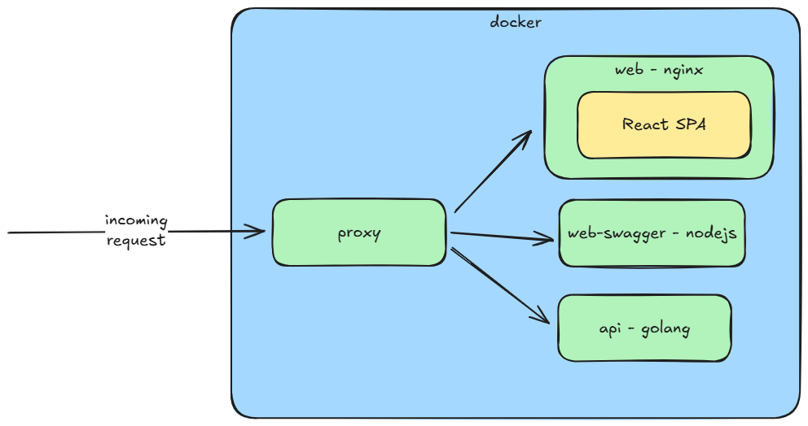

# architecture

## description
1. services
    1. [web](web), contain react frontend only implementation 
    2. [api](api), contain golang backend implementation 
    3. [web-swagger](web-swagger), contain api-spec documentation of `api`
2. orchestration are done via docker, 
    1. please refer to the [compose file](compose.yml) for more detail
    2. using LTS/latest version of respective base images 

## how to run
```
docker compose up
```

## visual
